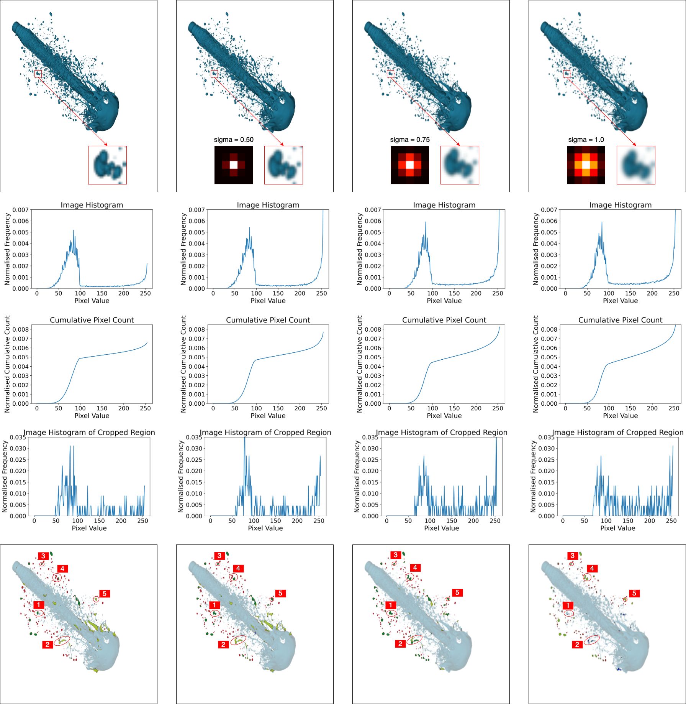

# Performance Assessment of U-Net for Semantic Segmentation of Liquid Spray Images with Gaussian Blurring

This is the code for [Performance Assessment of U-Net for Semantic Segmentation of Liquid Spray Images with Gaussian Blurring](https://ieeexplore.ieee.org/document/10397704) published in ICOCO 2023.

One of our interesting result: 

Read the article [here](https://drive.google.com/file/d/18JGnCdXw1LVvwUFYzxNzOa0zej7t4l5u/view?usp=sharing) or watch the [overview video](https://youtu.be/4nNI5r2cJsU).

If you are interested in how our U-Net is trained, please refer to [this repo](https://github.com/lynerlwl/DeepSpray-UNet).

If you use this code or found it helpful, please consider citing:

```bibtex
@inproceedings{lim2023performance,
  title={Performance Assessment of U-Net for Semantic Segmentation of Liquid Spray Images with Gaussian Blurring},
  author={Lim, Wei Lun and Teow, Matthew YW and Wong, Richard TK and Pathan, Refat Khan and Lau, Sian Lun and Ho, Chiung Ching and Bravo, Luis and Koneru, Rahul Babu and Khare, Prashant},
  booktitle={IEEE International Conference on Computing (ICOCO)},
  pages={462--467},
  year={2023}
}
```
